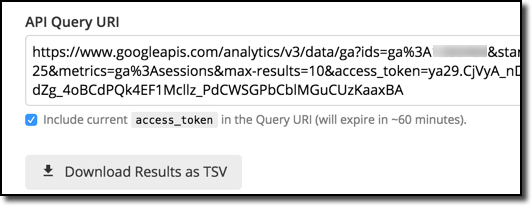

# ga-explorerr

Super simple way to get the data from the GA Query Explorer directly into R.

1) Build and run the query at the [Query Explorer](https://ga-dev-tools.appspot.com/query-explorer/)

2) Copy the **API QUERY URI**, making sure the `access token` is included:



3) Paste URI into an R variable:

```{r}
ga_url <- "https://www.googleapis.com/analytics/v3/data/ga?ids=ga%3A123456789..."
```

Load and source function and load required libraries:

```{r}
library(tidyverse)
library(stringr)
library(lubridate)
library(httr)

ga_explorer <- function() {
  results <- httr::GET(ga_url)
  httr::stop_for_status(results)
  res <- httr::content(results)
  colheaders <- purrr::map_chr(res$columnHeaders, "name") %>% stringr::str_replace("ga:","")
  coltypes <- purrr::map_chr(res$columnHeaders, "dataType")
  res <- purrr::map(res$rows, ~ purrr::set_names(.x, colheaders )) %>% dplyr::bind_rows()
  dataType <- function(x, type) {
    switch(type,
         INTEGER = as.integer(x),
         STRING = as.character(x),
         CURRENCY = as.numeric(x),
         PERCENT = as.numeric(x))
  }
  res <- purrr::map2_df(res, coltypes, dataType)
  if(!is.null(res[["date"]])) {
    res[["date"]] <- lubridate::ymd(res[["date"]])
  }
  res
}
```

The above function will use  `ga_url` and give you back a nice and tidy `tibble` and set the column types automatically.

```{r}
my_data <- ga_explorer()
```